# Clínica Online RZ

## Descripción general

Clínica Online RZ es una aplicación para digitalizar y optimizar la gestión de una clínica médica. Permite que administradores, especialistas y pacientes puedan interactuar fácilmente, gestionando turnos, pacientes, usuarios y accediendo a informes de gestión y estadísticas en tiempo real.

---

## Pantallas principales

### **Pantalla de Inicio**
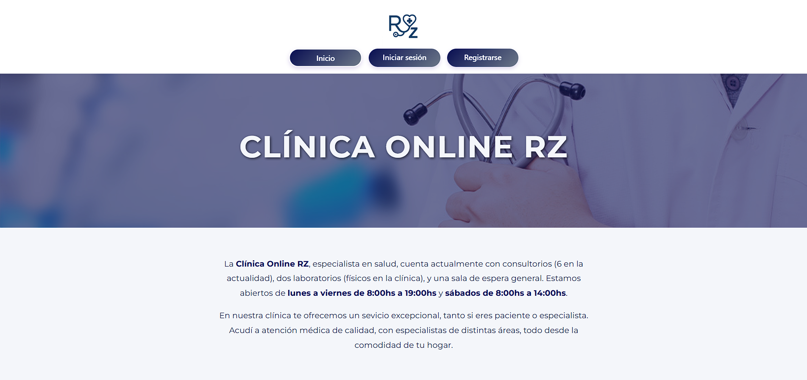
Home de la clínica con una breve descripción de la misma.

---

### **Pantalla de Login**
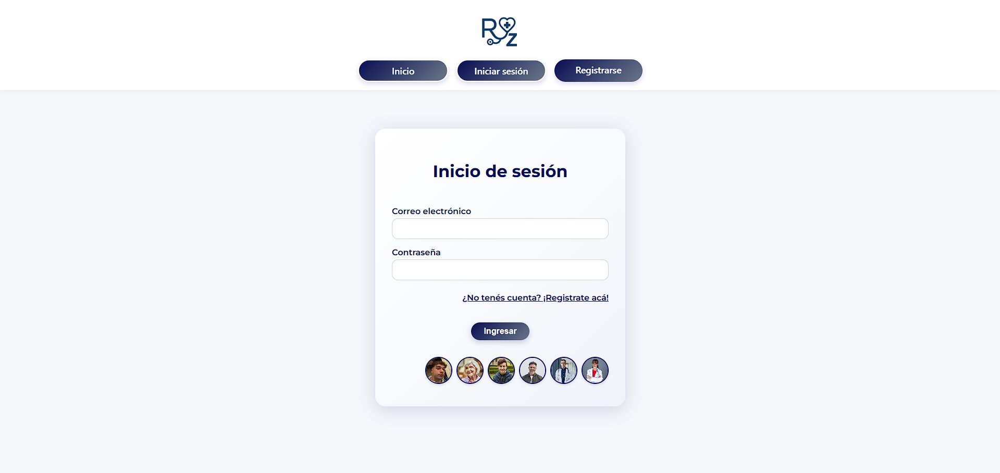
Formulario de ingreso de la app, con validaciones, botones de acceso rápido y con la opción de acceder a la página para registrarse.

---

### **Pantalla de Registro**
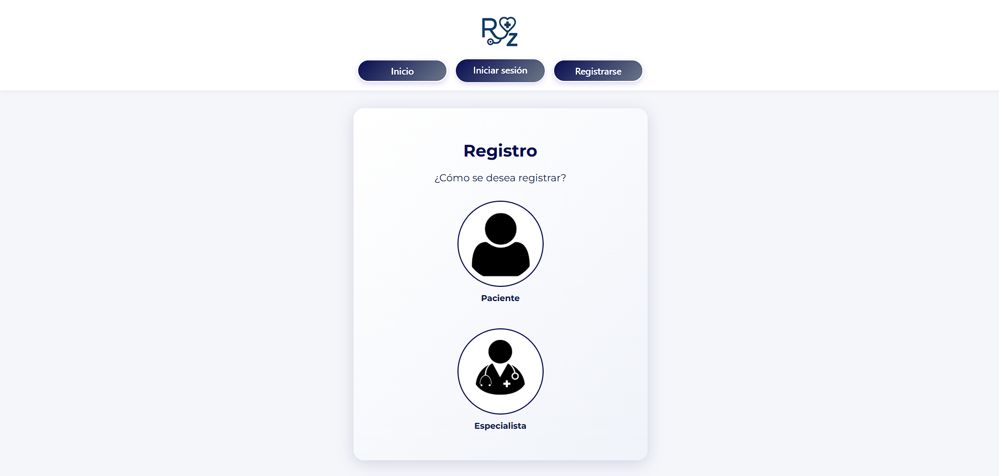
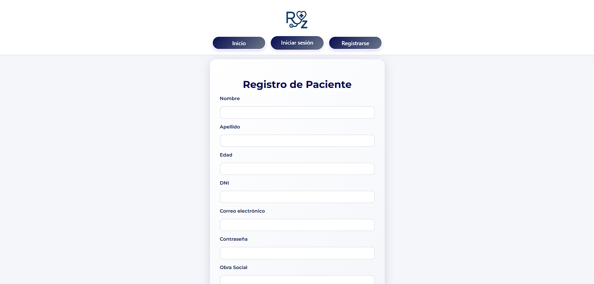
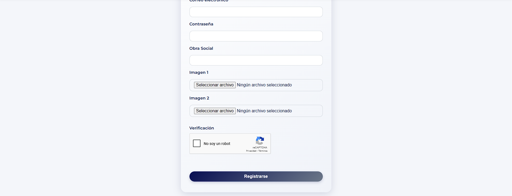
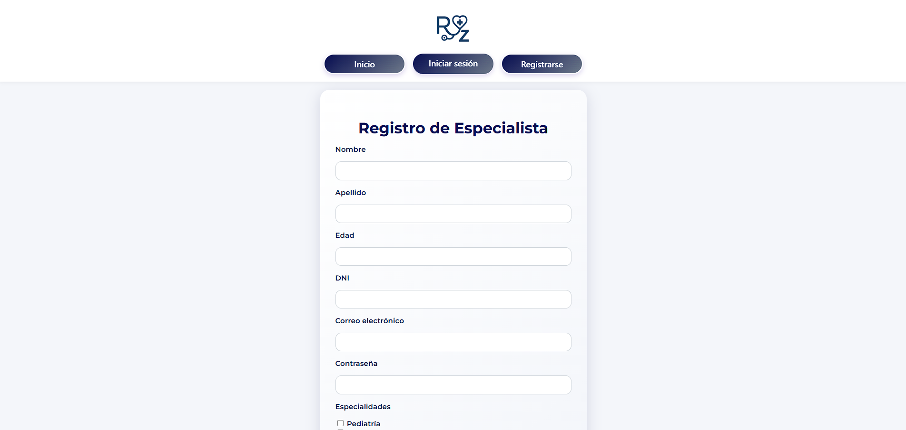
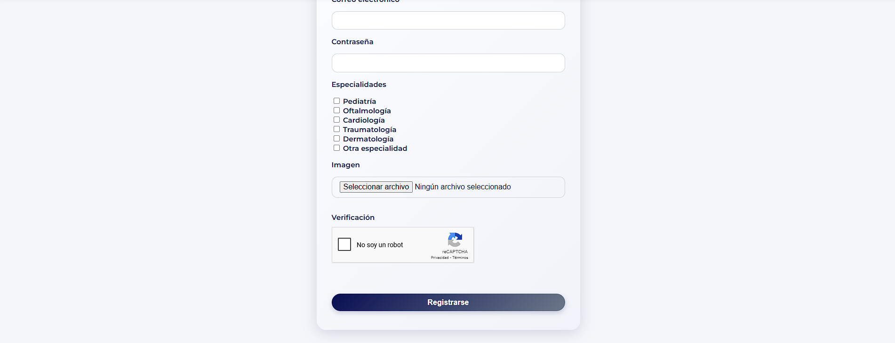
Formulario de registro de la app, permite elegir el rol del usuario, en base a eso me muestra el form con los campos correspondientes.

---

### **Pantalla de pacientes (Especialista)**
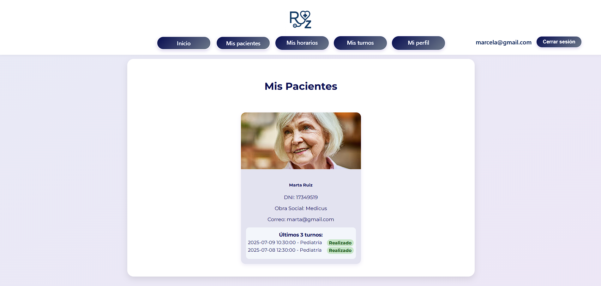
En la pantalla se ven las cards de los pacientes, con sus datos e información de sus últimos 3 turnos (al clickearlas vemos su historia clínica).

---

### **Pantalla de los horarios (Especialista)**
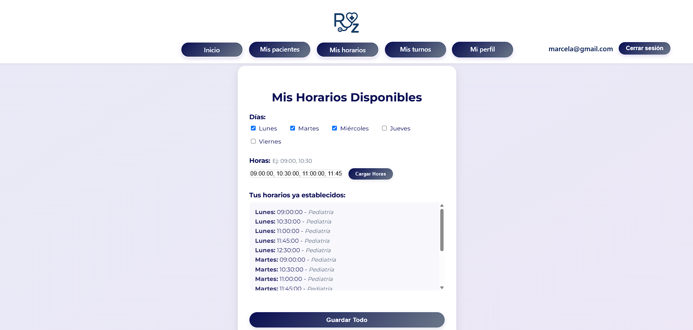
En esta sección el especialista puede asignar sus horarios.

---

### **Gestión de Turnos (Especialista)**
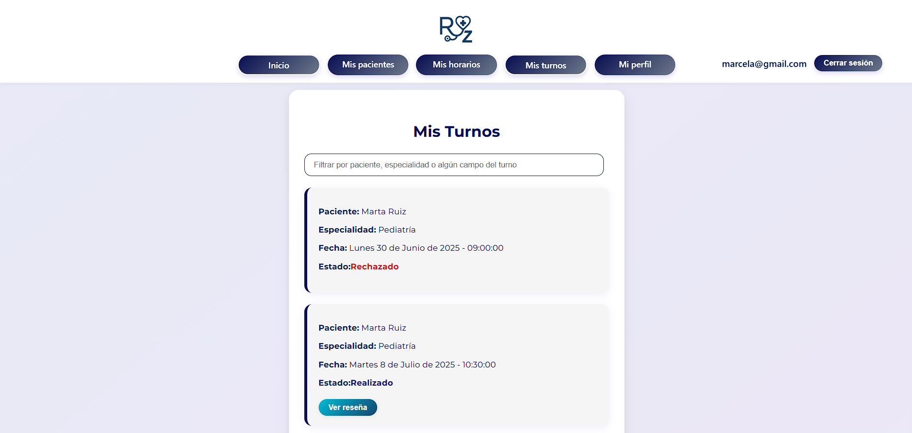
En esta página el especialista puede gestionar los turnos de sus pacientes.

---

### **Mi Perfil**
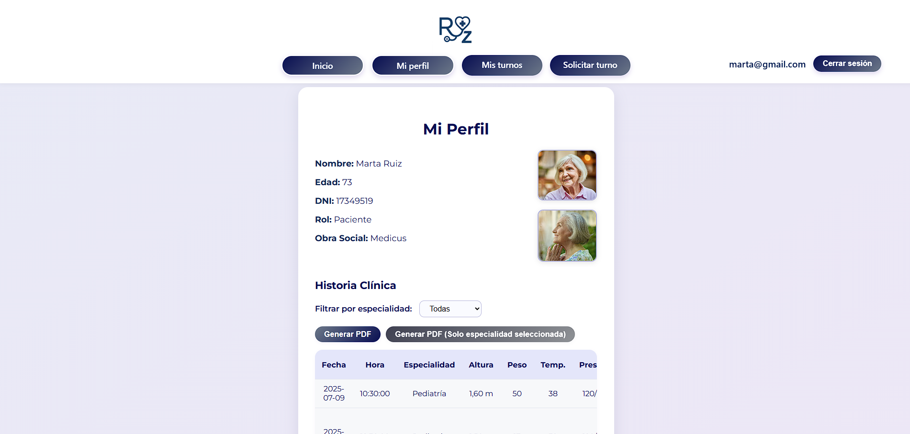
En esta sección el paciente puede ver los datos de su perfil y su historia clínica. Los especialistas y admins también tienen esta sección.

---

### **Mis turnos (Paciente)**
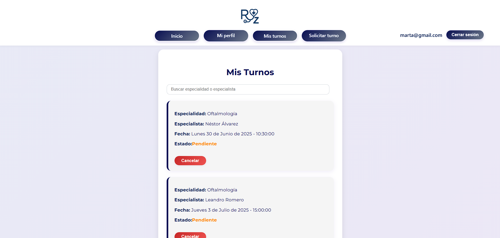
En esta página el paciente puede ver sus turnos con la información de los mismos y el estado de cada uno.

---

### **Solicitar Turno (Paciente)**
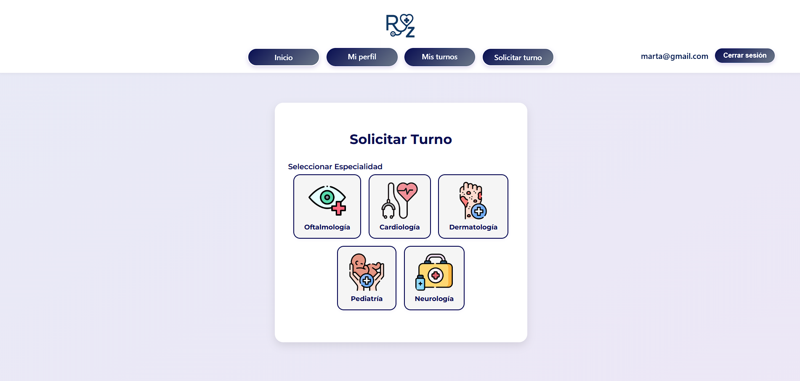
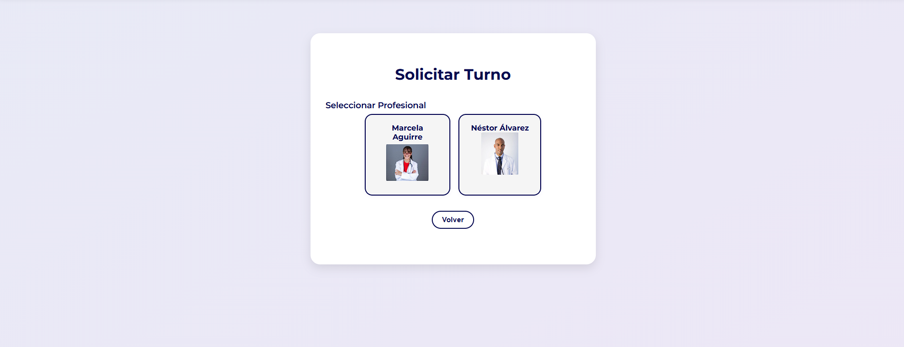
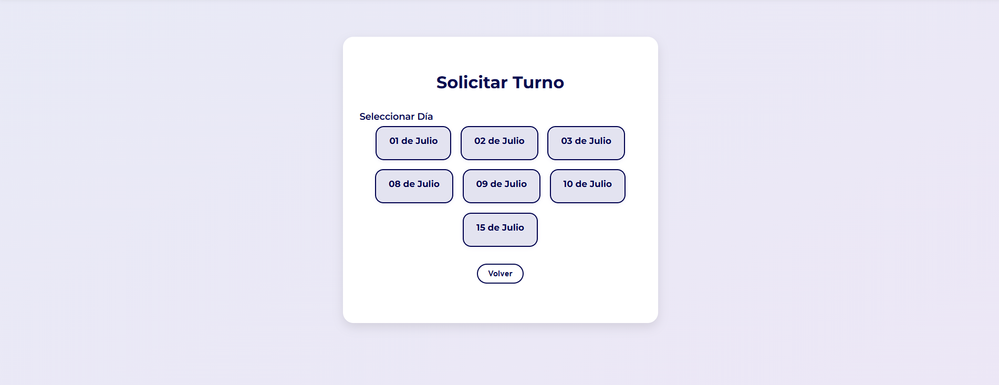
En esta sección el paciente puede solicitar un turno eligiendo especialidad, especialista, fecha y horario.

---

### **Usuarios (Admin)**
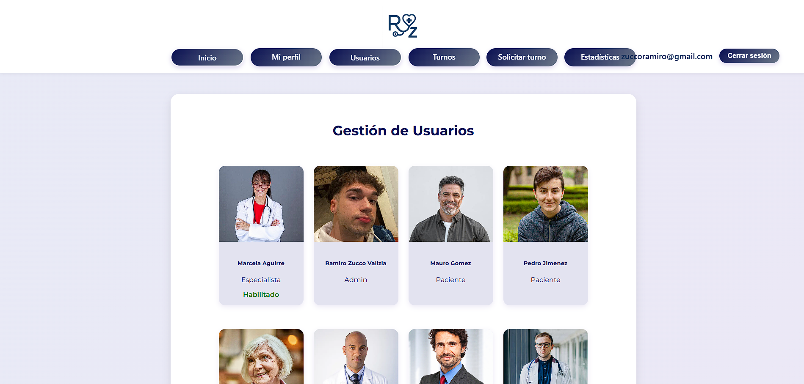
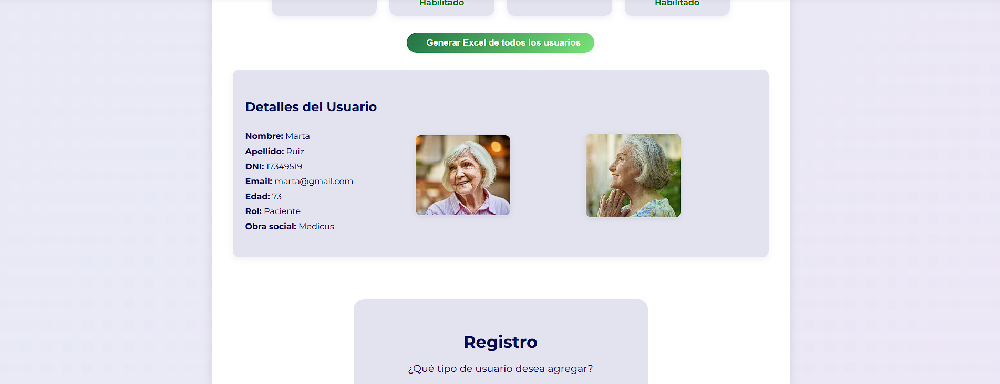
En esta página el admin puede ver todos los usuarios registrados y al clickear uno se puede ver su información. Desde acá el admin puede habilitar o deshabilitar especialistas y además registrar un nuevo usuario.

---

## Estadísticas (Admin)
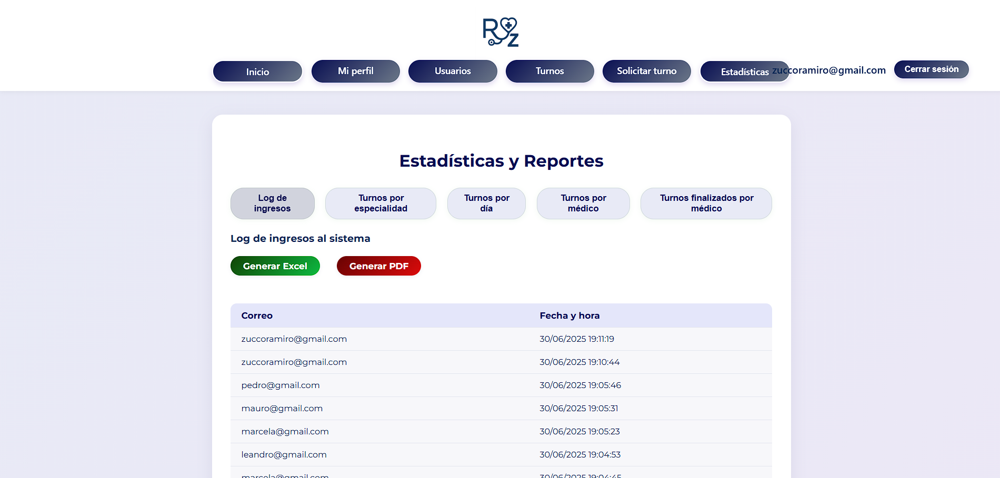
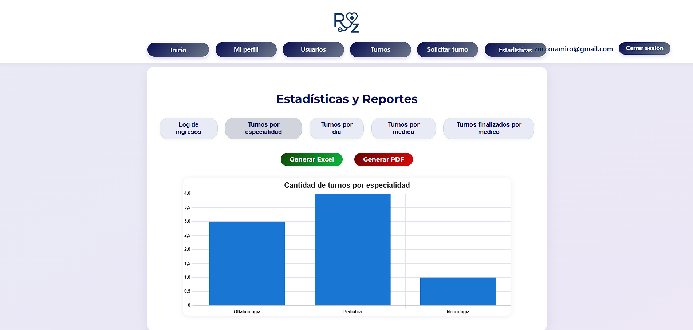
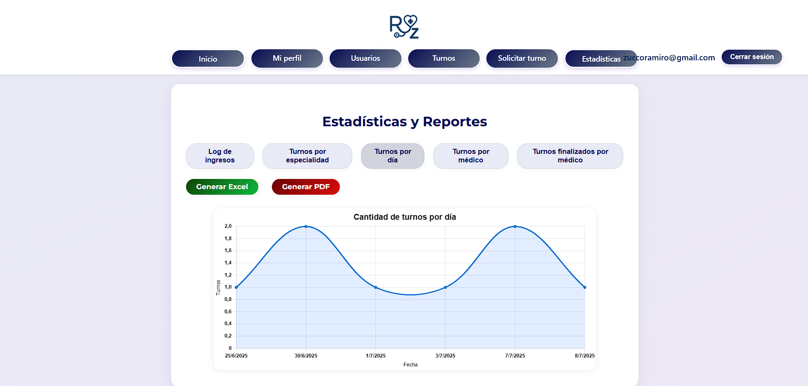
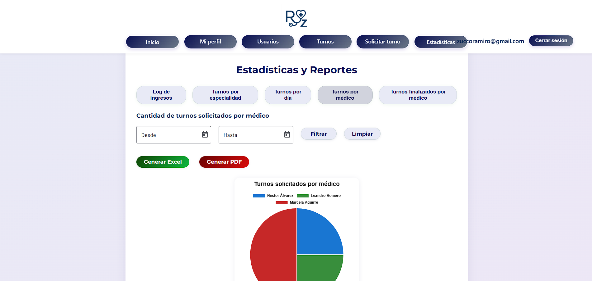
En esta sección se pueden ver distintos informes con gráficos acerca de estadísticas de la clínica.

---

## Creada por: Ramiro Zucco Valizia
